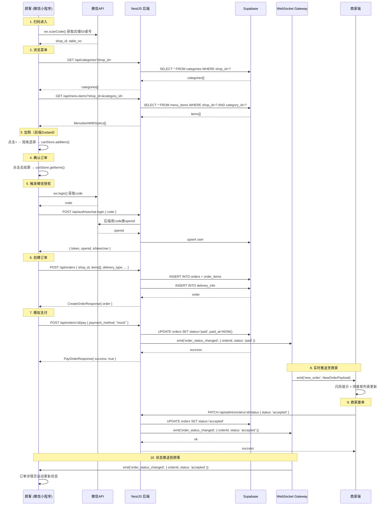
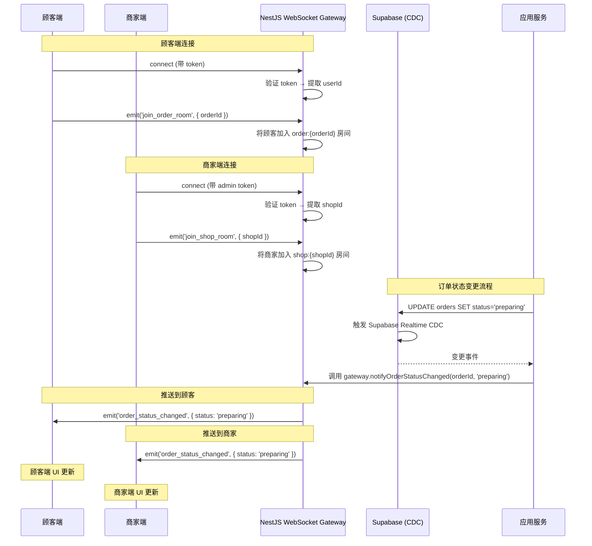
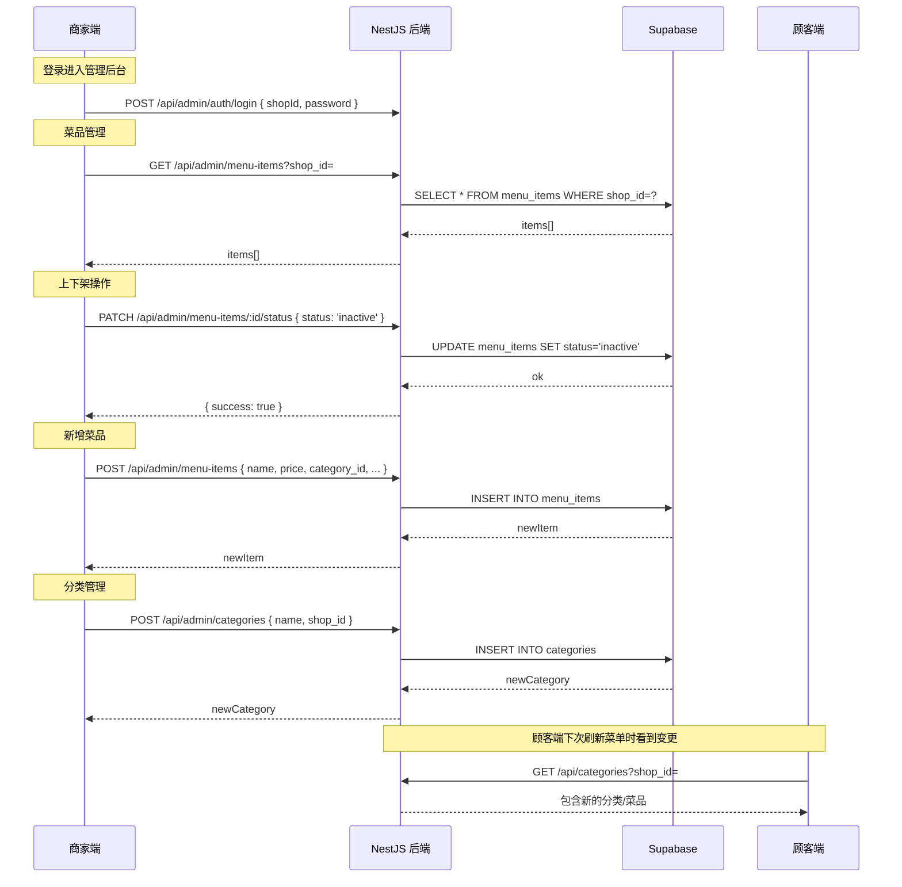
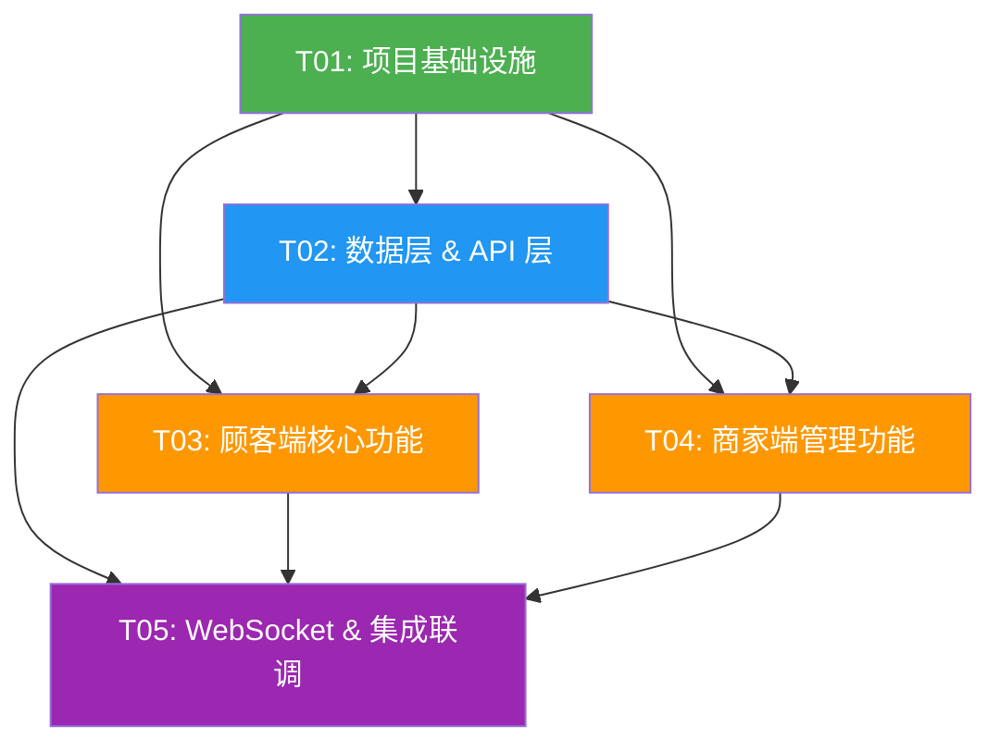

# 小买卖点餐系统 — 架构设计文档

> **版本**: v1.0  
> **创建日期**: 2025-06-15  
> **架构师**: Bob（Architect）  
> **状态**: 初稿审核中

---

## 目录

1. [实现方案与框架选型](#1-实现方案与框架选型)
2. [文件列表](#2-文件列表)
3. [数据结构和接口定义](#3-数据结构和接口定义)
4. [程序调用流程（时序图）](#4-程序调用流程时序图)
5. [任务分解](#5-任务分解)
6. [依赖包列表](#6-依赖包列表)
7. [共享知识](#7-共享知识)
8. [待明确事项](#8-待明确事项)

---

## 1. 实现方案与框架选型

### 1.1 整体技术架构

```
┌─────────────────────────────────────────────────────┐
│                   微信小程序                           │
│  Taro 4 + NutUI-React + TypeScript + Zustand        │
│                                                      │
│  ┌─────────┐ ┌──────────┐ ┌────────┐ ┌──────────┐  │
│  │ 菜单页   │ │ 确认订单  │ │ 订单详情│ │ 商家管理  │  │
│  └────┬────┘ └────┬─────┘ └───┬────┘ └────┬─────┘  │
│       │            │           │           │         │
│  ┌────┴────────────┴───────────┴───────────┴─────┐  │
│  │              Zustand Stores                    │  │
│  │    (cartStore, orderStore, menuStore)          │  │
│  └────────────────────────┬───────────────────────┘  │
│                           │                          │
│  ┌────────────────────────┴───────────────────────┐  │
│  │          API Services (HTTP + WebSocket)        │  │
│  └────────────────────────┬───────────────────────┘  │
└───────────────────────────┼──────────────────────────┘
                            │ HTTP / WSS
┌───────────────────────────┼──────────────────────────┐
│  ┌────────────────────────┴───────────────────────┐  │
│  │            NestJS Backend                       │  │
│  │  ┌────────┐ ┌──────┐ ┌──────┐ ┌────────────┐  │  │
│  │  │ Menu   │ │ Cart │ │Order │ │ Payment    │  │  │
│  │  │ Module │ │Module│ │Module│ │ Module     │  │  │
│  │  └────┬───┘ └──┬───┘ └──┬───┘ └─────┬──────┘  │  │
│  │       └────────┴────────┴────────────┘         │  │
│  │  ┌─────────────────────────────────────────┐   │  │
│  │  │        Prisma ORM / Supabase SDK         │   │  │
│  │  └─────────────────┬───────────────────────┘   │  │
│  └────────────────────┼──────────────────────────┘  │
└────────────────────────┼────────────────────────────┘
                         │
┌────────────────────────┼────────────────────────────┐
│  ┌─────────────────────┴────────────────────────┐   │
│  │           Supabase (BaaS)                     │   │
│  │  ┌──────────┐ ┌─────────┐ ┌───────────────┐  │   │
│  │  │PostgreSQL│ │  Auth   │ │  Realtime     │  │   │
│  │  │  (10张表) │ │(微信授权) │ │ (CDC推送)     │  │   │
│  │  └──────────┘ └─────────┘ └───────────────┘  │   │
│  └──────────────────────────────────────────────┘   │
└─────────────────────────────────────────────────────┘
```

### 1.2 核心技术栈选型理由

| 组件 | 选型 | 理由 |
|------|------|------|
| **前端框架** | Taro 4 | 一套代码多端编译，当前专注微信小程序，未来可扩展 H5/支付宝小程序 |
| **UI 组件库** | NutUI-React | Taro 官方推荐的 React 组件库，风格适配移动端，组件丰富（购物车、规格选择、Tab 切换等） |
| **状态管理** | Zustand | 轻量级（<1KB），TypeScript 支持优秀，无 Provider 包裹，适合小程序场景 |
| **后端框架** | NestJS | 模块化架构天然适合按业务拆分（菜单/订单/支付模块），内置 WebSocket Gateway 支持 |
| **数据库** | Supabase PostgreSQL | 开箱即用的 Postgres + Auth + Realtime，减少运维成本；RLS 行级权限满足多租户隔离 |
| **ORM** | Supabase JS SDK | 直接调用 Supabase SDK 操作数据库，无需额外 ORM；与 RLS 深度集成 |
| **实时推送** | NestJS WebSocket + Supabase Realtime | NestJS Gateway 负责业务消息路由；Supabase Realtime（CDC）监听数据库变更推送 |
| **支付** | 模拟支付 | MVP 阶段用模拟支付弹窗替代真实支付通道，后续接入微信支付 |

### 1.3 架构决策记录

| 决策 | 方案 | 原因 |
|------|------|------|
| 购物车持久化 | MVP 阶段纯前端 Zustand | 简化开发，避免登录前产生脏数据 |
| 用户认证时机 | 下单时触发微信授权 | 提升菜单浏览页的首屏加载速度，降低跳出率 |
| 商家入口 | 同一小程序内路由切换 | 避免维护两个小程序，通过角色标识区分视图 |
| 实时推送双通道 | NestJS Gateway + Supabase Realtime | NestJS 处理业务消息路由（如通知谁），Supabase 做数据层兜底同步 |
| RLS 策略 | 基于 `shop_id` 和 `user_id` | 顾客只能看自己的订单数据，商家只能看自己店铺的数据 |

---

## 2. 文件列表

### 2.1 前端 — Taro 微信小程序 (client/)

```
client/
├── project.config.json              # 微信小程序项目配置
├── project.tt.json                   # Taro 项目配置
├── tsconfig.json                     # TypeScript 配置
├── package.json                      # 依赖声明
├── babel.config.js                   # Babel 配置
├── config/
│   ├── index.ts                      # Taro 编译配置（开发/生产）
│   └── dev.ts                        # 开发环境配置（API 地址、Supabase key）
├── src/
│   ├── app.tsx                       # 小程序入口组件
│   ├── app.config.ts                 # 小程序全局配置（pages, window, tabBar）
│   ├── app.scss                      # 全局样式
│   ├── pages/
│   │   ├── menu/
│   │   │   ├── index.tsx             # 菜单浏览页（顾客端首页）
│   │   │   ├── index.config.ts       # 页面配置
│   │   │   └── index.scss            # 页面样式
│   │   ├── order-confirm/
│   │   │   ├── index.tsx             # 确认订单页
│   │   │   ├── index.config.ts
│   │   │   └── index.scss
│   │   ├── order-detail/
│   │   │   ├── index.tsx             # 订单详情页（顾客端看订单状态）
│   │   │   ├── index.config.ts
│   │   │   └── index.scss
│   │   ├── order-list/
│   │   │   ├── index.tsx             # 顾客订单列表页
│   │   │   ├── index.config.ts
│   │   │   └── index.scss
│   │   └── admin/
│   │       ├── index.tsx             # 商家订单管理页（首页Dashboard）
│   │       ├── index.config.ts
│   │       ├── index.scss
│   │       ├── menu-manage.tsx       # 商家菜品管理页
│   │       ├── menu-manage.config.ts
│   │       └── menu-manage.scss
│   ├── components/
│   │   ├── CategorySidebar/
│   │   │   ├── index.tsx             # 分类侧边栏组件
│   │   │   └── index.scss
│   │   ├── MenuCard/
│   │   │   ├── index.tsx             # 菜品卡片组件
│   │   │   └── index.scss
│   │   ├── CartBar/
│   │   │   ├── index.tsx             # 底部购物车栏组件
│   │   │   └── index.scss
│   │   ├── SpecSelector/
│   │   │   ├── index.tsx             # 规格选择弹窗组件
│   │   │   └── index.scss
│   │   ├── DeliverySelector/
│   │   │   ├── index.tsx             # 配送方式选择组件
│   │   │   └── index.scss
│   │   ├── OrderCard/
│   │   │   ├── index.tsx             # 订单卡片组件（商家端列表用）
│   │   │   └── index.scss
│   │   ├── RevenueSummary/
│   │   │   ├── index.tsx             # 今日营收概览组件
│   │   │   └── index.scss
│   │   └── StatusBadge/
│   │       ├── index.tsx             # 订单状态标签组件
│   │       └── index.scss
│   ├── stores/
│   │   ├── cartStore.ts              # 购物车状态（Zustand）
│   │   ├── menuStore.ts              # 菜单/分类状态
│   │   ├── orderStore.ts             # 订单状态
│   │   └── authStore.ts              # 用户认证状态
│   ├── services/
│   │   ├── api.ts                    # HTTP 客户端封装（基于 Taro.request）
│   │   ├── menuService.ts            # 菜单相关 API
│   │   ├── orderService.ts           # 订单相关 API
│   │   ├── shopService.ts            # 店铺相关 API
│   │   ├── adminService.ts           # 商家管理相关 API
│   │   └── websocket.ts             # WebSocket 客户端封装
│   ├── types/
│   │   ├── menu.ts                   # 菜单类型定义
│   │   ├── order.ts                  # 订单类型定义
│   │   ├── shop.ts                   # 店铺类型定义
│   │   ├── cart.ts                   # 购物车类型定义
│   │   └── api.ts                    # API 通用类型（响应格式等）
│   ├── utils/
│   │   ├── constants.ts              # 常量定义（状态枚举、金额格式化等）
│   │   ├── format.ts                 # 格式化工具函数
│   │   ├── storage.ts                # 本地存储工具
│   │   └── auth.ts                   # 微信授权工具函数
│   └── env.ts                        # 环境变量配置
```

### 2.2 后端 — NestJS (server/)

```
server/
├── package.json
├── tsconfig.json
├── tsconfig.build.json
├── nest-cli.json
├── .env                              # 环境变量（Supabase URL/Key、JWT Secret）
├── .env.example
├── supabase/
│   ├── migrations/
│   │   ├── 001_create_shops.sql
│   │   ├── 002_create_categories.sql
│   │   ├── 003_create_menu_items.sql
│   │   ├── 004_create_specs.sql
│   │   ├── 005_create_orders.sql
│   │   ├── 006_create_order_items.sql
│   │   ├── 007_create_delivery_info.sql
│   │   ├── 008_create_promotions.sql
│   │   └── 009_rls_policies.sql
│   └── seed.sql                      # 种子数据（示例店铺、分类、菜品）
├── src/
│   ├── main.ts                       # 应用入口（Bootstrap + WebSocket 端口）
│   ├── app.module.ts                 # 根模块
│   ├── common/
│   │   ├── decorators/
│   │   │   ├── current-user.decorator.ts   # 获取当前用户装饰器
│   │   │   └── roles.decorator.ts          # 角色装饰器
│   │   ├── guards/
│   │   │   ├── auth.guard.ts               # 认证守卫
│   │   │   └── roles.guard.ts              # 角色守卫
│   │   ├── filters/
│   │   │   └── http-exception.filter.ts    # 全局异常过滤器
│   │   ├── pipes/
│   │   │   └── validation.pipe.ts          # 全局参数校验管道
│   │   ├── interfaces/
│   │   │   ├── api-response.interface.ts   # API 统一响应格式
│   │   │   └── pagination.interface.ts     # 分页接口
│   │   └── constants/
│   │       └── enums.ts                    # 全局枚举（订单状态、配送方式等）
│   ├── database/
│   │   └── supabase.client.ts             # Supabase 客户端初始化
│   ├── modules/
│   │   ├── shop/
│   │   │   ├── shop.module.ts
│   │   │   ├── shop.controller.ts          # 店铺 API
│   │   │   ├── shop.service.ts
│   │   │   └── dto/
│   │   │       └── shop.dto.ts
│   │   ├── menu/
│   │   │   ├── menu.module.ts
│   │   │   ├── menu.controller.ts          # 菜单/分类 API
│   │   │   ├── menu.service.ts
│   │   │   └── dto/
│   │   │       ├── category.dto.ts
│   │   │       └── menu-item.dto.ts
│   │   ├── cart/
│   │   │   ├── cart.module.ts
│   │   │   ├── cart.controller.ts
│   │   │   ├── cart.service.ts
│   │   │   └── dto/
│   │   │       └── cart.dto.ts
│   │   ├── order/
│   │   │   ├── order.module.ts
│   │   │   ├── order.controller.ts         # 订单 API
│   │   │   ├── order.service.ts
│   │   │   └── dto/
│   │   │       ├── create-order.dto.ts
│   │   │       └── update-order.dto.ts
│   │   ├── payment/
│   │   │   ├── payment.module.ts
│   │   │   ├── payment.controller.ts       # 模拟支付 API
│   │   │   ├── payment.service.ts
│   │   │   └── dto/
│   │   │       └── payment.dto.ts
│   │   └── admin/
│   │       ├── admin.module.ts
│   │       ├── admin.controller.ts         # 商家管理 API（订单管理+菜品管理）
│   │       ├── admin.service.ts
│   │       └── dto/
│   │           ├── manage-order.dto.ts
│   │           └── manage-menu.dto.ts
│   └── gateway/
│       └── order.gateway.ts                # WebSocket Gateway（订单状态推送）
```

---

## 3. 数据结构和接口定义

### 3.1 核心 TypeScript 类型定义

#### 3.1.1 通用类型

```typescript
// types/api.ts — API 通用类型
export interface ApiResponse<T = unknown> {
  code: number;       // 0 = 成功, 非0 = 错误码
  data: T;
  message: string;
}

export interface PaginatedData<T> {
  items: T[];
  total: number;
  page: number;
  pageSize: number;
}

export interface PaginationParams {
  page?: number;
  pageSize?: number;
}

// common/constants/enums.ts — 全局枚举
export enum OrderStatus {
  PENDING_PAYMENT = 'pending_payment',     // 待支付
  PAID = 'paid',                            // 已支付
  ACCEPTED = 'accepted',                    // 商家已接单
  PREPARING = 'preparing',                  // 制作中
  DELIVERING = 'delivering',               // 配送中
  COMPLETED = 'completed',                  // 已完成
  CANCELLED = 'cancelled',                  // 已取消
  REJECTED = 'rejected',                    // 商家已拒绝
}

export enum DeliveryType {
  DELIVERY = 'delivery',   // 外卖配送
  PICKUP = 'pickup',       // 到店自取
  DINE_IN = 'dine_in',     // 堂食
}

export enum MenuItemStatus {
  ACTIVE = 'active',       // 在售
  INACTIVE = 'inactive',   // 下架
}

export enum ShopStatus {
  OPEN = 'open',
  CLOSED = 'closed',
}

export enum UserRole {
  CUSTOMER = 'customer',
  ADMIN = 'admin',
}
```

#### 3.1.2 数据库实体类型

```typescript
// types/shop.ts
export interface Shop {
  id: string;               // UUID
  name: string;             // 店铺名称
  address: string;          // 店铺地址
  phone: string;            // 联系电话
  logo_url: string | null;  // Logo 图片 URL
  status: ShopStatus;       // 营业状态
  table_count: number;      // 桌位数（堂食用）
  created_at: string;       // ISO 8601
  updated_at: string;
}

// types/menu.ts
export interface Category {
  id: string;
  shop_id: string;
  name: string;
  icon: string | null;      // 分类图标 emoji
  sort_order: number;       // 排序序号
  created_at: string;
  updated_at: string;
}

export interface MenuItem {
  id: string;
  shop_id: string;
  category_id: string;
  name: string;
  description: string | null;
  price: number;            // 单位：分（避免浮点数精度问题）
  image_url: string | null;
  status: MenuItemStatus;
  sales_count: number;      // 销量
  sort_order: number;
  spec_group_id: string | null;  // 关联的规格组
  created_at: string;
  updated_at: string;
}

export interface SpecGroup {
  id: string;
  shop_id: string;
  name: string;             // 如"口味"、"份量"
  created_at: string;
  updated_at: string;
}

export interface SpecOption {
  id: string;
  group_id: string;
  name: string;             // 如"微辣"、"中份"
  price_adjust: number;     // 价格调整（分），可为负值
  sort_order: number;
  created_at: string;
  updated_at: string;
}

export interface MenuItemWithSpecs extends MenuItem {
  category?: Category;
  spec_group?: SpecGroup & { options: SpecOption[] };
}

// types/order.ts
export interface Order {
  id: string;
  shop_id: string;
  user_id: string;          // 顾客微信 openid
  order_no: string;         // 可读订单号，如 "ORD-20250615-0001"
  status: OrderStatus;
  total_amount: number;     // 总金额（分）
  delivery_type: DeliveryType;
  delivery_address: string | null;
  table_no: string | null;  // 桌号（堂食）
  remark: string | null;
  paid_at: string | null;
  completed_at: string | null;
  created_at: string;
  updated_at: string;
}

export interface OrderItem {
  id: string;
  order_id: string;
  item_id: string;
  item_name: string;        // 冗余：下单时菜品名称（历史记录）
  spec_desc: string | null; // 规格描述，如"微辣/大份"
  quantity: number;
  unit_price: number;       // 单价（分）
  subtotal: number;         // 小计（分）
  created_at: string;
}

export interface DeliveryInfo {
  id: string;
  order_id: string;
  type: DeliveryType;
  address: string | null;   // 外卖地址
  contact_name: string | null;
  contact_phone: string | null;
  table_no: string | null;  // 堂餐桌号
  created_at: string;
}

// types/cart.ts — 纯前端类型（Zustand 管理，不落库）
export interface CartItem {
  item: MenuItem;
  spec?: SpecOption;
  quantity: number;
}

export interface CartState {
  items: CartItem[];
  shopId: string | null;
  // Actions
  addItem: (item: MenuItem, spec?: SpecOption) => void;
  removeItem: (itemId: string, specId?: string) => void;
  updateQuantity: (itemId: string, quantity: number, specId?: string) => void;
  clearCart: () => void;
  getTotalAmount: () => number;
  getItemCount: () => number;
}
```

#### 3.1.3 API 请求/响应类型

```typescript
// services/menuService.ts — 菜单 API
export interface GetMenuParams {
  shopId: string;
  categoryId?: string;
}

export interface GetMenuResponse {
  categories: Category[];
  items: MenuItemWithSpecs[];
}

// services/orderService.ts — 订单 API
export interface CreateOrderRequest {
  shop_id: string;
  delivery_type: DeliveryType;
  delivery_address?: string;
  contact_name?: string;
  contact_phone?: string;
  table_no?: string;
  remark?: string;
  items: {
    item_id: string;
    spec_id?: string;
    quantity: number;
  }[];
}

export interface CreateOrderResponse {
  order: Order;
  payment_url?: string;  // 模拟支付用
}

export interface PayOrderRequest {
  order_id: string;
  payment_method: string; // "mock"
}

export interface PayOrderResponse {
  success: boolean;
  transaction_id?: string;
}

// services/adminService.ts — 商家管理 API
export interface GetAdminOrdersParams {
  shopId: string;
  status?: OrderStatus;
  page?: number;
  pageSize?: number;
}

export interface UpdateOrderStatusRequest {
  order_id: string;
  status: OrderStatus;
  reason?: string;  // 拒绝原因
}

export interface RevenueSummary {
  total_orders: number;
  total_amount: number;  // 分
  today_date: string;
}

// 菜品管理
export interface CreateMenuItemRequest {
  shop_id: string;
  category_id: string;
  name: string;
  description?: string;
  price: number;
  image_url?: string;
  sort_order?: number;
  spec_group_id?: string;
}

export interface UpdateMenuItemRequest {
  name?: string;
  description?: string;
  price?: number;
  image_url?: string;
  status?: MenuItemStatus;
  category_id?: string;
  sort_order?: number;
  spec_group_id?: string;
}

export interface CreateCategoryRequest {
  shop_id: string;
  name: string;
  icon?: string;
  sort_order?: number;
}
```

#### 3.1.4 Zustand Store 类型

```typescript
// stores/authStore.ts
export interface AuthState {
  isLoggedIn: boolean;
  openid: string | null;
  role: UserRole | null;
  shopId: string | null;      // 商家管理的店铺 ID
  // Actions
  login: () => Promise<void>;  // 触发微信授权
  loginAsAdmin: (shopId: string) => Promise<void>;  // 商家登录
  logout: () => void;
}

// stores/menuStore.ts
export interface MenuState {
  categories: Category[];
  items: MenuItemWithSpecs[];
  activeCategoryId: string | null;
  loading: boolean;
  // Actions
  fetchMenu: (shopId: string) => Promise<void>;
  setActiveCategory: (categoryId: string) => void;
}

// stores/orderStore.ts
export interface OrderState {
  currentOrder: Order | null;
  orderList: Order[];
  loading: boolean;
  // Actions
  createOrder: (req: CreateOrderRequest) => Promise<Order>;
  fetchOrderDetail: (orderId: string) => Promise<void>;
  fetchOrderList: (userId: string) => Promise<void>;
}
```

### 3.2 数据库表结构（Supabase PostgreSQL）

```sql
-- Supabase 默认使用 UUID，以下简化为主键设计

-- 店铺表
CREATE TABLE shops (
  id          UUID PRIMARY KEY DEFAULT gen_random_uuid(),
  name        VARCHAR(100) NOT NULL,
  address     TEXT,
  phone       VARCHAR(20),
  logo_url    TEXT,
  status      VARCHAR(20) NOT NULL DEFAULT 'open',
  table_count INTEGER DEFAULT 0,
  created_at  TIMESTAMPTZ DEFAULT NOW(),
  updated_at  TIMESTAMPTZ DEFAULT NOW()
);

-- 菜品分类
CREATE TABLE categories (
  id          UUID PRIMARY KEY DEFAULT gen_random_uuid(),
  shop_id     UUID NOT NULL REFERENCES shops(id),
  name        VARCHAR(50) NOT NULL,
  icon        VARCHAR(10),
  sort_order  INTEGER DEFAULT 0,
  created_at  TIMESTAMPTZ DEFAULT NOW(),
  updated_at  TIMESTAMPTZ DEFAULT NOW()
);
CREATE INDEX idx_categories_shop ON categories(shop_id, sort_order);

-- 菜品
CREATE TABLE menu_items (
  id            UUID PRIMARY KEY DEFAULT gen_random_uuid(),
  shop_id       UUID NOT NULL REFERENCES shops(id),
  category_id   UUID NOT NULL REFERENCES categories(id),
  name          VARCHAR(100) NOT NULL,
  description   TEXT,
  price         INTEGER NOT NULL,        -- 单位：分
  image_url     TEXT,
  status        VARCHAR(20) NOT NULL DEFAULT 'active',
  sales_count   INTEGER DEFAULT 0,
  sort_order    INTEGER DEFAULT 0,
  spec_group_id UUID REFERENCES spec_groups(id),
  created_at    TIMESTAMPTZ DEFAULT NOW(),
  updated_at    TIMESTAMPTZ DEFAULT NOW()
);
CREATE INDEX idx_menu_items_shop ON menu_items(shop_id, category_id, sort_order);

-- 规格组
CREATE TABLE spec_groups (
  id          UUID PRIMARY KEY DEFAULT gen_random_uuid(),
  shop_id     UUID NOT NULL REFERENCES shops(id),
  name        VARCHAR(50) NOT NULL,      -- "口味", "份量"
  created_at  TIMESTAMPTZ DEFAULT NOW(),
  updated_at  TIMESTAMPTZ DEFAULT NOW()
);

-- 规格选项
CREATE TABLE spec_options (
  id            UUID PRIMARY KEY DEFAULT gen_random_uuid(),
  group_id      UUID NOT NULL REFERENCES spec_groups(id),
  name          VARCHAR(50) NOT NULL,    -- "微辣", "大份"
  price_adjust  INTEGER DEFAULT 0,       -- 价格调整（分）
  sort_order    INTEGER DEFAULT 0,
  created_at    TIMESTAMPTZ DEFAULT NOW(),
  updated_at    TIMESTAMPTZ DEFAULT NOW()
);
CREATE INDEX idx_spec_options_group ON spec_options(group_id, sort_order);

-- 订单主表
CREATE TABLE orders (
  id                UUID PRIMARY KEY DEFAULT gen_random_uuid(),
  shop_id           UUID NOT NULL REFERENCES shops(id),
  user_id           VARCHAR(100) NOT NULL,   -- 微信 openid
  order_no          VARCHAR(50) NOT NULL UNIQUE,
  status            VARCHAR(30) NOT NULL DEFAULT 'pending_payment',
  total_amount      INTEGER NOT NULL,        -- 总金额（分）
  delivery_type     VARCHAR(20) NOT NULL,
  delivery_address  TEXT,
  table_no          VARCHAR(10),
  remark            TEXT,
  paid_at           TIMESTAMPTZ,
  completed_at      TIMESTAMPTZ,
  created_at        TIMESTAMPTZ DEFAULT NOW(),
  updated_at        TIMESTAMPTZ DEFAULT NOW()
);
CREATE INDEX idx_orders_shop_status ON orders(shop_id, status);
CREATE INDEX idx_orders_user ON orders(user_id);

-- 订单明细
CREATE TABLE order_items (
  id          UUID PRIMARY KEY DEFAULT gen_random_uuid(),
  order_id    UUID NOT NULL REFERENCES orders(id),
  item_id     UUID NOT NULL,
  item_name   VARCHAR(100) NOT NULL,
  spec_desc   VARCHAR(100),
  quantity    INTEGER NOT NULL,
  unit_price  INTEGER NOT NULL,         -- 单价（分）
  subtotal    INTEGER NOT NULL,         -- 小计（分）
  created_at  TIMESTAMPTZ DEFAULT NOW()
);
CREATE INDEX idx_order_items_order ON order_items(order_id);

-- 配送信息
CREATE TABLE delivery_info (
  id            UUID PRIMARY KEY DEFAULT gen_random_uuid(),
  order_id      UUID NOT NULL REFERENCES orders(id),
  type          VARCHAR(20) NOT NULL,
  address       TEXT,
  contact_name  VARCHAR(50),
  contact_phone VARCHAR(20),
  table_no      VARCHAR(10),
  created_at    TIMESTAMPTZ DEFAULT NOW()
);

-- 活动优惠（P1）
CREATE TABLE promotions (
  id          UUID PRIMARY KEY DEFAULT gen_random_uuid(),
  shop_id     UUID NOT NULL REFERENCES shops(id),
  type        VARCHAR(30) NOT NULL,     -- "full_reduction", "first_order"
  rule        JSONB NOT NULL,           -- {"threshold": 3000, "discount": 500}
  status      VARCHAR(20) DEFAULT 'active',
  created_at  TIMESTAMPTZ DEFAULT NOW(),
  updated_at  TIMESTAMPTZ DEFAULT NOW()
);
```

### 3.3 REST API 端点设计

| 方法 | 路径 | 说明 | 认证 | 角色 |
|------|------|------|------|------|
| `GET` | `/api/shops/:id` | 获取店铺信息 | - | - |
| `GET` | `/api/categories?shop_id=` | 获取分类列表 | - | - |
| `GET` | `/api/menu-items?shop_id=&category_id=` | 获取菜品列表 | - | - |
| `GET` | `/api/menu-items/:id` | 获取菜品详情（含规格） | - | - |
| `POST` | `/api/orders` | 创建订单 | ✅ | customer |
| `GET` | `/api/orders/:id` | 获取订单详情 | ✅ | customer/admin |
| `GET` | `/api/orders?user_id=&status=&page=` | 顾客订单列表 | ✅ | customer |
| `POST` | `/api/orders/:id/pay` | 模拟支付 | ✅ | customer |
| `GET` | `/api/admin/orders?shop_id=&status=` | 商家订单列表 | ✅ | admin |
| `PATCH` | `/api/admin/orders/:id/status` | 更新订单状态 | ✅ | admin |
| `GET` | `/api/admin/revenue?shop_id=&date=` | 今日营收概览 | ✅ | admin |
| `POST` | `/api/admin/categories` | 创建分类 | ✅ | admin |
| `PUT` | `/api/admin/categories/:id` | 编辑分类 | ✅ | admin |
| `DELETE` | `/api/admin/categories/:id` | 删除分类 | ✅ | admin |
| `POST` | `/api/admin/menu-items` | 创建菜品 | ✅ | admin |
| `PUT` | `/api/admin/menu-items/:id` | 编辑菜品 | ✅ | admin |
| `PATCH` | `/api/admin/menu-items/:id/status` | 上下架菜品 | ✅ | admin |
| `POST` | `/api/admin/spec-groups` | 创建规格组 | ✅ | admin |
| `POST` | `/api/admin/spec-options` | 创建规格选项 | ✅ | admin |

### 3.4 WebSocket 事件定义

```typescript
// gateway/order.gateway.ts

// 服务端 → 客户端事件
export enum ServerToClientEvents {
  NEW_ORDER = 'new_order',                 // 新订单通知 → 商家
  ORDER_STATUS_CHANGED = 'order_status_changed',  // 订单状态变更 → 顾客+商家
  ADMIN_NOTIFICATION = 'admin_notification',      // 商家通知
}

// 客户端 → 服务端事件
export enum ClientToServerEvents {
  JOIN_SHOP_ROOM = 'join_shop_room',       // 商家加入店铺房间
  JOIN_ORDER_ROOM = 'join_order_room',     // 顾客加入订单房间
  LEAVE_ROOM = 'leave_room',              // 离开房间
}

// 事件负载
export interface NewOrderPayload {
  orderId: string;
  orderNo: string;
  shopId: string;
  totalAmount: number;
  createdAt: string;
}

export interface OrderStatusChangedPayload {
  orderId: string;
  orderNo: string;
  status: OrderStatus;
  updatedAt: string;
  shopId?: string;
}
```

---

## 4. 程序调用流程（时序图）

### 4.1 核心业务流程：扫码 → 点餐 → 下单 → 支付



### 4.2 WebSocket 连接与实时推送流程



### 4.3 商家管理菜品流程



---

## 5. 任务分解

### 5.1 任务总览

总共 **5 个任务**，按依赖顺序排列。

| 任务ID | 任务名称 | 优先级 | 前置依赖 | 涉及文件数 |
|--------|----------|--------|----------|-----------|
| T01 | 项目基础设施搭建 | P0 | - | 15+ |
| T02 | 数据层 & API 层（后端核心） | P0 | T01 | 25+ |
| T03 | 顾客端核心功能（菜单+购物车+下单） | P0 | T01, T02 | 20+ |
| T04 | 商家端管理功能 | P0 | T01, T02 | 15+ |
| T05 | WebSocket 实时推送 & 集成联调 | P0 | T02, T03, T04 | 10+ |

### 5.2 任务详情

#### T01: 项目基础设施搭建

- **名称**: 项目基础设施搭建
- **优先级**: P0
- **前置依赖**: 无
- **估算工作量**: 1 人天

**涉及文件**:

| 模块 | 文件路径 |
|------|----------|
| 前端配置 | `client/package.json`, `client/tsconfig.json`, `client/babel.config.js`, `client/config/index.ts`, `client/config/dev.ts`, `client/project.config.json` |
| 前端入口 | `client/src/app.tsx`, `client/src/app.config.ts`, `client/src/app.scss`, `client/src/env.ts` |
| 后端配置 | `server/package.json`, `server/tsconfig.json`, `server/tsconfig.build.json`, `server/nest-cli.json`, `server/.env`, `server/.env.example` |
| 后端入口 | `server/src/main.ts`, `server/src/app.module.ts` |

**具体内容**:
1. 使用 `create-taro-app` 初始化 Taro 4 项目（React + TypeScript 模板）
2. 配置 Taro 小程序编译参数（appid: `wx93c16508eff05096`）
3. 安装 NutUI-React、Zustand 等前端依赖
4. 使用 `@nestjs/cli` 初始化 NestJS 项目
5. 配置 Supabase 连接（环境变量）
6. 配置 CORS、全局前缀 `/api`、全局 ValidationPipe
7. 验证 `npm run dev` 和 `npm run start:dev` 均可正常运行

---

#### T02: 数据层 & API 层（后端核心）

- **名称**: 数据层 & API 层开发
- **优先级**: P0
- **前置依赖**: T01
- **估算工作量**: 3 人天

**涉及文件**:

| 模块 | 文件路径 |
|------|----------|
| 公共模块 | `server/src/common/constants/enums.ts`, `server/src/common/interfaces/api-response.interface.ts`, `server/src/common/interfaces/pagination.interface.ts`, `server/src/common/decorators/current-user.decorator.ts`, `server/src/common/guards/auth.guard.ts`, `server/src/common/filters/http-exception.filter.ts`, `server/src/common/pipes/validation.pipe.ts` |
| 数据库 | `server/src/database/supabase.client.ts` |
| 店铺模块 | `server/src/modules/shop/shop.module.ts`, `server/src/modules/shop/shop.controller.ts`, `server/src/modules/shop/shop.service.ts` |
| 菜单模块 | `server/src/modules/menu/menu.module.ts`, `server/src/modules/menu/menu.controller.ts`, `server/src/modules/menu/menu.service.ts`, `server/src/modules/menu/dto/category.dto.ts`, `server/src/modules/menu/dto/menu-item.dto.ts` |
| 订单模块 | `server/src/modules/order/order.module.ts`, `server/src/modules/order/order.controller.ts`, `server/src/modules/order/order.service.ts`, `server/src/modules/order/dto/create-order.dto.ts`, `server/src/modules/order/dto/update-order.dto.ts` |
| 支付模块 | `server/src/modules/payment/payment.module.ts`, `server/src/modules/payment/payment.controller.ts`, `server/src/modules/payment/payment.service.ts` |
| 数据库迁移 | `server/supabase/migrations/001_create_shops.sql` ~ `009_rls_policies.sql`, `server/supabase/seed.sql` |
| 前端类型 | `client/src/types/menu.ts`, `client/src/types/order.ts`, `client/src/types/shop.ts`, `client/src/types/cart.ts`, `client/src/types/api.ts` |
| 前端工具 | `client/src/utils/constants.ts`, `client/src/utils/format.ts` |

**具体内容**:
1. 设计并执行 Supabase 数据库迁移（9 个 SQL 文件）
2. 配置 Supabase RLS 策略（customer 和 admin 角色隔离）
3. 编写种子数据 SQL（示例店铺 + 烧烤类分类 + 菜品 + 规格）
4. 实现所有后端 Module（Controller + Service）
5. 实现全局 Auth Guard（JWT token 验证）
6. 实现统一 API 响应格式拦截器
7. 实现全局异常过滤器
8. 定义前端完整类型定义文件

**关键 API 端点清单**:
- `GET /api/shops/:id`
- `GET /api/categories?shop_id=`
- `GET /api/menu-items?shop_id=&category_id=`
- `GET /api/menu-items/:id` (含规格)
- `POST /api/orders`
- `GET /api/orders/:id`
- `GET /api/orders?user_id=&status=`
- `POST /api/orders/:id/pay` (模拟支付)
- `POST /api/auth/wechat-login`

---

#### T03: 顾客端核心功能（菜单 + 购物车 + 下单 + 支付）

- **名称**: 顾客端核心功能开发
- **优先级**: P0
- **前置依赖**: T01, T02
- **估算工作量**: 3 人天

**涉及文件**:

| 模块 | 文件路径 |
|------|----------|
| 页面 | `client/src/pages/menu/index.tsx`, `client/src/pages/menu/index.config.ts`, `client/src/pages/menu/index.scss`, `client/src/pages/order-confirm/index.tsx`, `client/src/pages/order-confirm/index.config.ts`, `client/src/pages/order-confirm/index.scss`, `client/src/pages/order-detail/index.tsx`, `client/src/pages/order-detail/index.config.ts`, `client/src/pages/order-detail/index.scss`, `client/src/pages/order-list/index.tsx`, `client/src/pages/order-list/index.config.ts`, `client/src/pages/order-list/index.scss` |
| 组件 | `client/src/components/CategorySidebar/index.tsx`, `client/src/components/CategorySidebar/index.scss`, `client/src/components/MenuCard/index.tsx`, `client/src/components/MenuCard/index.scss`, `client/src/components/CartBar/index.tsx`, `client/src/components/CartBar/index.scss`, `client/src/components/SpecSelector/index.tsx`, `client/src/components/SpecSelector/index.scss`, `client/src/components/DeliverySelector/index.tsx`, `client/src/components/DeliverySelector/index.scss`, `client/src/components/StatusBadge/index.tsx`, `client/src/components/StatusBadge/index.scss` |
| Store | `client/src/stores/cartStore.ts`, `client/src/stores/menuStore.ts`, `client/src/stores/orderStore.ts`, `client/src/stores/authStore.ts` |
| 服务 | `client/src/services/api.ts`, `client/src/services/menuService.ts`, `client/src/services/orderService.ts`, `client/src/services/shopService.ts` |
| 工具 | `client/src/utils/storage.ts`, `client/src/utils/auth.ts` |

**具体内容**:
1. **菜单浏览页**: 左分类侧边栏 + 右菜品网格列表、切换分类联动、菜品卡片展示（名称/价格/图片/销量标记）
2. **规格选择弹窗**: 点击菜品 '+' 按钮 → 有规格则弹出选择 → 确认后加入购物车
3. **底部购物车栏**: 固定定位、加减按钮、总价显示、展开购物车详情（支持批量修改和删除）
4. **确认订单页**: 菜品清单展示、配送方式选择（外卖/自取/堂食联动）、地址输入（微信 API）、备注输入（快捷标签）、合计金额
5. **模拟支付**: 点击确认支付 → 弹窗提示"支付成功" → 跳转订单详情页
6. **订单详情页**: 完整状态流转展示（待支付→已支付→商家接单→制作中→配送中→已完成）
7. **顾客订单列表**: 按状态展示历史订单
8. **微信授权流程**: 下单时触发 `wx.login()` → 用 code 换取 openid
9. **Zustand Stores**: cartStore（购物车增删改查）、menuStore（菜单数据缓存）、orderStore（订单状态）、authStore（登录状态）

---

#### T04: 商家端管理功能

- **名称**: 商家端管理功能开发
- **优先级**: P0
- **前置依赖**: T01, T02
- **估算工作量**: 2.5 人天

**涉及文件**:

| 模块 | 文件路径 |
|------|----------|
| 页面 | `client/src/pages/admin/index.tsx`, `client/src/pages/admin/index.config.ts`, `client/src/pages/admin/index.scss`, `client/src/pages/admin/menu-manage.tsx`, `client/src/pages/admin/menu-manage.config.ts`, `client/src/pages/admin/menu-manage.scss` |
| 组件 | `client/src/components/OrderCard/index.tsx`, `client/src/components/OrderCard/index.scss`, `client/src/components/RevenueSummary/index.tsx`, `client/src/components/RevenueSummary/index.scss` |
| 后端模块 | `server/src/modules/admin/admin.module.ts`, `server/src/modules/admin/admin.controller.ts`, `server/src/modules/admin/admin.service.ts`, `server/src/modules/admin/dto/manage-order.dto.ts`, `server/src/modules/admin/dto/manage-menu.dto.ts` |
| 前端服务 | `client/src/services/adminService.ts` |

**具体内容**:
1. **商家订单管理页**:
   - 顶部今日营收卡片（总订单数 + 总金额）
   - 按状态 Tab 分组（待接单/制作中/配送中/已完成/全部）
   - 订单卡片展示完整信息（订单号、时间、顾客名、配送方式、菜品清单、备注、合计）
   - 操作按钮：接单/拒绝 → 出餐 → 完成配送/已完成
2. **商家菜品管理页**:
   - 菜品列表展示（含上下架状态切换）
   - 菜品 CRUD（新增/编辑/删除）
   - 分类 CRUD（新增/编辑/删除）
   - 规格组管理
3. **后端 Admin Module**:
   - 商家订单列表（按 shop_id + status 筛选）
   - 更新订单状态（含状态流转校验）
   - 今日营收统计
   - 菜品 CRUD + 上下架
   - 分类 CRUD
   - 规格管理

---

#### T05: WebSocket 实时推送 & 集成联调

- **名称**: WebSocket 实时推送 & 集成联调
- **优先级**: P0
- **前置依赖**: T02, T03, T04
- **估算工作量**: 1.5 人天

**涉及文件**:

| 模块 | 文件路径 |
|------|----------|
| Gateway | `server/src/gateway/order.gateway.ts` |
| 前端 WS | `client/src/services/websocket.ts` |
| 后端集成 | 修改 `server/src/modules/order/order.service.ts`（加 WS 推送调用）、修改 `server/src/modules/admin/admin.service.ts`（加 WS 推送调用） |
| 前端集成 | 修改 `client/src/pages/admin/index.tsx`（集成 WS 事件）、修改 `client/src/pages/order-detail/index.tsx`（集成 WS 事件） |
| 样式调整 | `client/src/pages/admin/index.scss`（新订单闪烁动画） |

**具体内容**:
1. **NestJS WebSocket Gateway**:
   - 实现 `OrderGateway`，继承 `WebSocketGateway`
   - `joinShopRoom` — 商家连接时加入 `shop:{shopId}` 房间
   - `joinOrderRoom` — 顾客连接时加入 `order:{orderId}` 房间
   - `notifyNewOrder` — 新订单推送到对应 shop room
   - `notifyOrderStatusChanged` — 状态变更推送到 order room + shop room
2. **前端 WebSocket 封装**:
   - 基于 Taro 的 `connectSocket` API 封装
   - 自动重连机制
   - 事件分发到对应 Store
3. **后端集成**:
   - `order.service.ts` 中创建订单后调用 `OrderGateway.notifyNewOrder()`
   - `admin.service.ts` 中修改订单状态后调用 `OrderGateway.notifyOrderStatusChanged()`
4. **前端集成**:
   - 商家端连接 WS → 加入 shop room → 监听 new_order / order_status_changed → 更新列表
   - 顾客端连接 WS → 加入 order room → 监听 order_status_changed → 更新详情页状态
   - 新订单到达商家端时的闪烁提示动画
5. **联调测试**:
   - 完整走通：顾客扫码→下单→支付→商家接单→出餐→完成的全流程
   - 验证实时推送延迟 < 1s

### 5.3 任务依赖图



---

## 6. 依赖包列表

### 6.1 前端 (client/)

```json
{
  "dependencies": {
    "@tarojs/components": "^4.0.0",
    "@tarojs/runtime": "^4.0.0",
    "@tarojs/taro": "^4.0.0",
    "@tarojs/react": "^4.0.0",
    "@nutui/nutui-react-taro": "^2.0.0",
    "react": "^18.2.0",
    "react-dom": "^18.2.0",
    "zustand": "^4.5.0",
    "dayjs": "^1.11.0"
  },
  "devDependencies": {
    "@tarojs/cli": "^4.0.0",
    "@tarojs/mini-runner": "^4.0.0",
    "@tarojs/webpack-runner": "^4.0.0",
    "@types/react": "^18.2.0",
    "@typescript-eslint/eslint-plugin": "^6.0.0",
    "typescript": "^5.3.0",
    "sass": "^1.69.0"
  }
}
```

### 6.2 后端 (server/)

```json
{
  "dependencies": {
    "@nestjs/common": "^10.3.0",
    "@nestjs/core": "^10.3.0",
    "@nestjs/platform-express": "^10.3.0",
    "@nestjs/platform-socket.io": "^10.3.0",
    "@nestjs/websockets": "^10.3.0",
    "@nestjs/jwt": "^10.2.0",
    "@supabase/supabase-js": "^2.40.0",
    "reflect-metadata": "^0.1.14",
    "rxjs": "^7.8.0",
    "class-validator": "^0.14.0",
    "class-transformer": "^0.5.1",
    "socket.io": "^4.7.0",
    "dayjs": "^1.11.0",
    "uuid": "^9.0.0"
  },
  "devDependencies": {
    "@nestjs/cli": "^10.3.0",
    "@nestjs/schematics": "^10.1.0",
    "@types/node": "^20.10.0",
    "@types/uuid": "^9.0.0",
    "@typescript-eslint/eslint-plugin": "^6.0.0",
    "typescript": "^5.3.0",
    "ts-node": "^10.9.0",
    "nodemon": "^3.0.0"
  }
}
```

---

## 7. 共享知识

### 7.1 命名规范

| 类型 | 规范 | 示例 |
|------|------|------|
| **前端变量/函数** | camelCase | `getMenuItems()`, `activeCategoryId` |
| **前端组件** | PascalCase | `MenuCard`, `CartBar`, `SpecSelector` |
| **前端文件** | kebab-case | `cart-store.ts`, `menu-service.ts` |
| **后端类** | PascalCase | `OrderService`, `MenuController` |
| **后端文件** | kebab-case | `order.service.ts`, `menu.controller.ts` |
| **数据库表** | snake_case 复数 | `menu_items`, `spec_groups` |
| **数据库列** | snake_case | `shop_id`, `delivery_type` |
| **API 路径** | kebab-case 复数 | `/api/menu-items`, `/api/admin/orders` |
| **枚举值** | UPPER_SNAKE_CASE | `PENDING_PAYMENT`, `DINE_IN` |

### 7.2 统一 API 响应格式

```typescript
// 成功响应
{
  code: 0,
  data: { ... },   // 实际数据
  message: "success"
}

// 错误响应
{
  code: 40001,            // 业务错误码
  data: null,
  message: "订单状态无效，无法执行此操作"
}

// 分页响应
{
  code: 0,
  data: {
    items: [...],
    total: 100,
    page: 1,
    pageSize: 20
  },
  message: "success"
}
```

**HTTP 状态码约定**:
| 状态码 | 使用场景 |
|--------|----------|
| 200 | 请求成功 |
| 201 | 资源创建成功（POST） |
| 400 | 参数校验失败 / 业务逻辑错误 |
| 401 | 未认证（token 缺失或无效） |
| 403 | 无权限（角色不足） |
| 404 | 资源不存在 |
| 500 | 服务器内部错误 |

### 7.3 错误处理策略

1. **后端**: 全局异常过滤器 `HttpExceptionFilter` 捕获所有异常，统一返回 `ApiResponse` 格式
2. **前端**: `api.ts` 中封装统一的请求拦截器，对 `code !== 0` 的响应做 Toast 提示
3. **状态流转校验**: 订单状态变更必须在后端做严格校验（如不允许从「已完成」回退到「制作中」）
4. **表单校验**: 前端使用 class-validator DTO + ValidationPipe 做后端参数校验，前端做第一层预校验

### 7.4 金额处理约定

- **所有金额存储单位为「分」**（整数），避免浮点数精度问题
- **前端展示时**通过 `format.ts` 中的 `formatPrice(priceInCents)` 转换为元（保留两位小数）
- **API 传输**统一使用分（整数），前端接口层做转换

### 7.5 时间格式约定

- **存储格式**: PostgreSQL `TIMESTAMPTZ`（带时区）
- **API 传输**: ISO 8601 字符串（如 `2025-06-15T12:30:00.000Z`）
- **前端展示**: 使用 `dayjs` 格式化（如 `12:30`、`06-15 12:30`）

### 7.6 Supabase RLS 策略要点

```sql
-- 顾客角色：只能看到已登录用户的 own 数据
-- 商家角色：只能看到自己 shop_id 的数据

-- 示例：orders 表的 RLS
CREATE POLICY "Customers can view their own orders" ON orders
  FOR SELECT
  USING (user_id = auth.uid()::text);

CREATE POLICY "Admins can view their shop orders" ON orders
  FOR SELECT
  USING (
    shop_id IN (
      SELECT shop_id FROM admin_users WHERE user_id = auth.uid()::text
    )
  );

CREATE POLICY "Customers can create orders" ON orders
  FOR INSERT
  WITH CHECK (user_id = auth.uid()::text);
```

### 7.7 认证流程

```
顾客端:
  扫码进入 → 游客模式浏览菜单
  ↓
  点击"去结算" → 触发 wx.login() 获取 code
  ↓
  调用 POST /api/auth/wechat-login { code }
  ↓
  后端用 code 向微信服务器换取 openid
  ↓
  返回 JWT token + openid
  ↓
  前端存储 token → 后续请求带 Authorization header

商家端:
  小程序内点击"商家入口"
  ↓
  输入店铺 ID + 管理员密码（或扫码验证）
  ↓
  登录成功后切换至管理视图
```

### 7.8 WebSocket 安全

1. 客户端连接 WebSocket 时携带 JWT token，Gateway 在 `handleConnection` 中验证
2. 商家加入 shop room 时校验该商家是否有该 shop 的管理权限
3. 顾客加入 order room 时校验该订单是否属于该顾客

---

## 8. 待明确事项

以下为当前设计阶段尚不明确的问题，需与产品经理（Alice）和团队进一步确认：

### 8.1 认证与权限

| # | 问题 | 建议方案 | 待确认 |
|---|------|----------|--------|
| 1 | 商家管理员如何创建/注册？ | MVP 阶段种子数据中预置一个管理员账号（shop_id + 密码），后续迭代做商家入驻流程 | ✅ |
| 2 | 商家登录使用什么认证方式？ | 建议使用手机号验证码（微信小程序`getPhoneNumber`），或简单密码登录 | ❓ |
| 3 | 同一 Supabase 实例如何区分顾客和商家角色？ | 在 `auth.users` 的 `raw_user_meta_data` 中存 `role` 字段 | ❓ |

### 8.2 业务逻辑

| # | 问题 | 建议方案 | 待确认 |
|---|------|----------|--------|
| 4 | 模拟支付成功后是否需要生成交易流水号？ | 生成唯一 `transaction_id`（格式：`MOCK-{timestamp}-{random}`），便于后续对账 | ✅ |
| 5 | 顾客端的「订单列表」是否需要？ | PRD 未明确列出列表页，建议 MVP 加上，让顾客能查看历史订单状态 | ❓ |
| 6 | 堂食模式下，桌号如何传递？ | 建议二维码 URL 带上 `table_no` 参数，扫码自动带入，顾客也可手动输入 | ❓ |
| 7 | 商家「拒绝」订单是否需要填写原因？ | 建议增加可选字段 `reject_reason`，顾客端可看到 | ❓ |

### 8.3 数据与部署

| # | 问题 | 建议方案 | 待确认 |
|---|------|----------|--------|
| 8 | Supabase 项目是否已创建？ | 需要提前创建 Supabase 项目并获取 `url` 和 `anon key` | ❓ |
| 9 | 小程序是否需要配置合法域名？ | 需要将 NestJS 部署域名和 Supabase 域名加入微信小程序白名单 | ❓ |
| 10 | 小程序图片使用什么存储方案？ | Supabase Storage，菜品图片直接上传到 Supabase 的公共 bucket | ✅ |
| 11 | 后端部署在什么环境？ | 建议先用本地开发（`localhost`），后续部署到云服务器或 Vercel/Railway | ✅ |

### 8.4 P1 功能预留

| # | 问题 | 说明 |
|---|------|------|
| 12 | 满减促销规则的数据结构是否需提前建表？ | 已在迁移 SQL 中预留 `promotions` 表，但 MVP 暂不使用 |
| 13 | 微信订阅消息的 template_id 是否需要提前申请？ | 需要商家在微信公众平台申请并配置 |

---

> **文档维护者**: Bob（Architect）  
> **最后更新**: 2025-06-15  
> **审批人**: 待定
